# Image LoRA Trainer

A CLI tool to train LoRA adapters for text-to-image models using a folder of images with intelligent content-aware cropping.


## How It Works

```mermaid
flowchart TD
    Start(["📁 Input Images"]) --> Load["Load Images"]
    Load --> Check{"Crop Focus\nSpecified?"}
    
    Check -->|Yes| YOLO["🔍 YOLO11 Detection"]
    Check -->|No| Center["Center Crop"]
    
    YOLO --> Found{"Target\nFound?"}
    Found -->|Yes| Crop["Smart Crop\n+ Padding"]
    Found -->|No| Skip["⏭️ Skip Image"]
    
    Center --> Resize["Resize to\nTarget Resolution"]
    Crop --> Resize
    
    Resize --> Train["🎯 LoRA Training\n(Diffusers + PEFT)"]
    Skip --> Log
    
    Train --> Save["💾 Save LoRA\nWeights"]
    Save --> Log["📊 Generate\ntraining_log.json"]
    
    Log --> End(["✅ Trained LoRA\n+ Logs"])
    
    style Start fill:#E8F4F8,stroke:#2C5F7C,stroke-width:3px,color:#1a1a1a
    style Load fill:#FFF4E6,stroke:#8B6914,stroke-width:2px,color:#1a1a1a
    style Check fill:#F0E6FF,stroke:#6B46C1,stroke-width:2px,color:#1a1a1a
    style YOLO fill:#E6F7FF,stroke:#1E5A8E,stroke-width:2px,color:#1a1a1a
    style Center fill:#FFF0F5,stroke:#8B4789,stroke-width:2px,color:#1a1a1a
    style Found fill:#F0E6FF,stroke:#6B46C1,stroke-width:2px,color:#1a1a1a
    style Crop fill:#E6FFE6,stroke:#2D5F2D,stroke-width:2px,color:#1a1a1a
    style Skip fill:#FFE6E6,stroke:#8B2E2E,stroke-width:2px,color:#1a1a1a
    style Resize fill:#FFF4E6,stroke:#8B6914,stroke-width:2px,color:#1a1a1a
    style Train fill:#E6F7FF,stroke:#1E5A8E,stroke-width:2px,color:#1a1a1a
    style Save fill:#E6FFE6,stroke:#2D5F2D,stroke-width:2px,color:#1a1a1a
    style Log fill:#FFF4E6,stroke:#8B6914,stroke-width:2px,color:#1a1a1a
    style End fill:#E8F4F8,stroke:#2C5F7C,stroke-width:3px,color:#1a1a1a
```



## Features

- **Content-Aware Cropping**: Uses YOLO11 segmentation to automatically detect and crop to specific objects from [the COCO dataset (faces, people, animals, etc.)](https://github.com/ultralytics/ultralytics/blob/main/ultralytics/cfg/datasets/coco.yaml)
- **Smart Filtering**: Automatically skips images that don't contain the target feature
- **Training Logs**: Generates detailed JSON logs of processed, skipped, and failed images
- **LoRA/QLoRA Training**: Full training pipeline using `diffusers` and `peft` with optional 4-bit quantization
- **Multiple Model Support**: Works with Stable Diffusion 1.5, SDXL, and other diffusion models
- **Visual Verification**: Includes a generation script to test your trained LoRA

## Installation

Requires Python 3.13+ and `uv` for dependency management.

```bash
# Clone the repository
git clone <your-repo-url>
cd image-lora-trainer

# Install dependencies
uv sync
```

### GPU Setup (Required)

**This tool requires a CUDA-capable GPU.** Training on CPU is impractically slow for diffusion models.

1. **Verify you have a CUDA-capable NVIDIA GPU**

2. **Install CUDA 13 drivers** from [NVIDIA's website](https://developer.nvidia.com/cuda-downloads)

3. **Install PyTorch with CUDA support:**

   ```bash
   uv pip uninstall torch torchvision -y
   uv pip install torch torchvision --index-url https://download.pytorch.org/whl/cu130
   ```

   Its about 1.73 GB to download.

4. **Verify GPU is detected:**

   ```bash
   uv run python -c "import torch; print('CUDA available:', torch.cuda.is_available()); print('GPU:', torch.cuda.get_device_name(0) if torch.cuda.is_available() else 'No GPU')"
   ```

   You should see something like:
   
   ```
   CUDA available: True
   GPU: NVIDIA GeForce RTX 4070 Ti
   ```

   If you see `CUDA available: False`, the CPU-only version of PyTorch is installed. Follow step 3 above.

## Quick Start

### 1. Prepare Your Images

Place your training images in a folder:
```
my_images/
├── photo1.jpg
├── photo2.png
└── photo3.jpg
```

### 2. Train a LoRA

Basic training:
```bash
uv run python src/main.py --input-dir my_images --base-model runwayml/stable-diffusion-v1-5
```

With content-aware cropping (only trains on images with faces):
```bash
uv run python src/main.py \
  --input-dir my_images \
  --base-model runwayml/stable-diffusion-v1-5 \
  --crop-focus person \
  --resolution 512 \
  --steps 1000
```

With QLoRA (4-bit quantization for lower memory usage):
```bash
uv run python src/main.py \
  --input-dir my_images \
  --base-model stabilityai/stable-diffusion-xl-base-1.0 \
  --use-qlora \
  --resolution 1024
```

### 3. Check Training Results

After training, check the `training_log.json` in your output directory:
```json
{
  "base_folder": "/absolute/path/to/my_images",
  "trained": ["image1.png", "image2.png"],
  "skipped": ["image3.png"],
  "failed": []
}
```

### 4. Generate Images with Your LoRA

```bash
uv run python src/generate.py \
  --base-model runwayml/stable-diffusion-v1-5 \
  --lora-path stable-diffusion-v1-5_my_images \
  --prompt "a photo of a sks person" \
  --output result.png
```

**Important:** Use the same trigger word ("sks" in this example) that you specified in `--instance-prompt` during training.

More generation examples:
```bash
# Portrait with different styling
uv run python src/generate.py --lora-path <path> --prompt "portrait of sks person, oil painting"

# Different context
uv run python src/generate.py --lora-path <path> --prompt "sks person in a futuristic city"
```

## CLI Options

### Training (`src/main.py`)

| Option | Description | Default |
|--------|-------------|---------|
| `--input-dir` | Path to training images | Required |
| `--output-dir` | Output directory for LoRA | Current directory |
| `--base-model` | Hugging Face model ID or local path | `runwayml/stable-diffusion-v1-5` |
| `--resolution` | Training image resolution | 512 |
| `--crop-focus` | Object to focus on (e.g., "person", "face", "dog") | None (center crop) |
| `--use-qlora` | Enable 4-bit quantization | False |
| `--instance-prompt` | Training prompt with trigger word | "a photo of a sks person" |
| `--steps` | Number of training steps | 1000 |
| `--epochs` | Number of epochs (overrides steps) | None |

**About `--instance-prompt`:**
The instance prompt contains a **trigger word** (like "sks") that the model learns to associate with your training images. This trigger word is what you'll use later when generating images with the LoRA.

- Use a unique, uncommon token (e.g., "sks", "xyz", "abc123")
- Include the class name (e.g., "person", "dog", "style")
- Example: `"a photo of sks person"` → Use `"sks person"` in generation prompts

### Generation (`src/generate.py`)

| Option | Description | Default |
|--------|-------------|---------|
| `--base-model` | Base model ID or path | `runwayml/stable-diffusion-v1-5` |
| `--lora-path` | Path to trained LoRA | Required |
| `--prompt` | Generation prompt | Required |
| `--output` | Output filename | `output.png` |
| `--steps` | Inference steps | 30 |

## Content-Aware Cropping

When you specify `--crop-focus`, the tool uses [YOLO11](https://docs.ultralytics.com/models/yolo11/) to detect objects in your images:

- **Supported objects**: Any object in the COCO dataset (person, dog, cat, car, etc.)
- **Behavior**: Images without the target object are automatically skipped
- **Fallback**: If no focus is specified, images are center-cropped

Example crop focuses:
- `person` - Crops to people
- `face` - Crops to faces (use "person" for full body)
- `dog`, `cat` - Crops to animals
- `car`, `truck` - Crops to vehicles

## Development

### Running Tests

```bash
uv run pytest tests/
```

### Linting and Formatting

```bash
uv run ruff check src/ tests/
uv run ruff format src/ tests/
```

## Output Structure

After training, your output directory will contain:
```
stable-diffusion-v1-5_my_images/
├── adapter_config.json       # LoRA configuration
├── adapter_model.safetensors # LoRA weights
├── training_log.json         # Processing log
├── logs/                     # Training logs
└── processed_images/         # Preprocessed images
```

## Requirements

- Python 3.13+
- CUDA-capable GPU (recommended)
- ~8GB VRAM for SD1.5, ~16GB for SDXL (less with QLoRA)

## License

[Your License Here]

## Acknowledgments

- Built with [Ultralytics YOLO11](https://docs.ultralytics.com/models/yolo11/)
- Uses [Hugging Face Diffusers](https://github.com/huggingface/diffusers)
- LoRA implementation via [PEFT](https://github.com/huggingface/peft)
